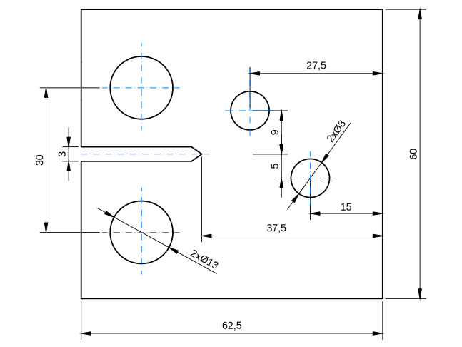
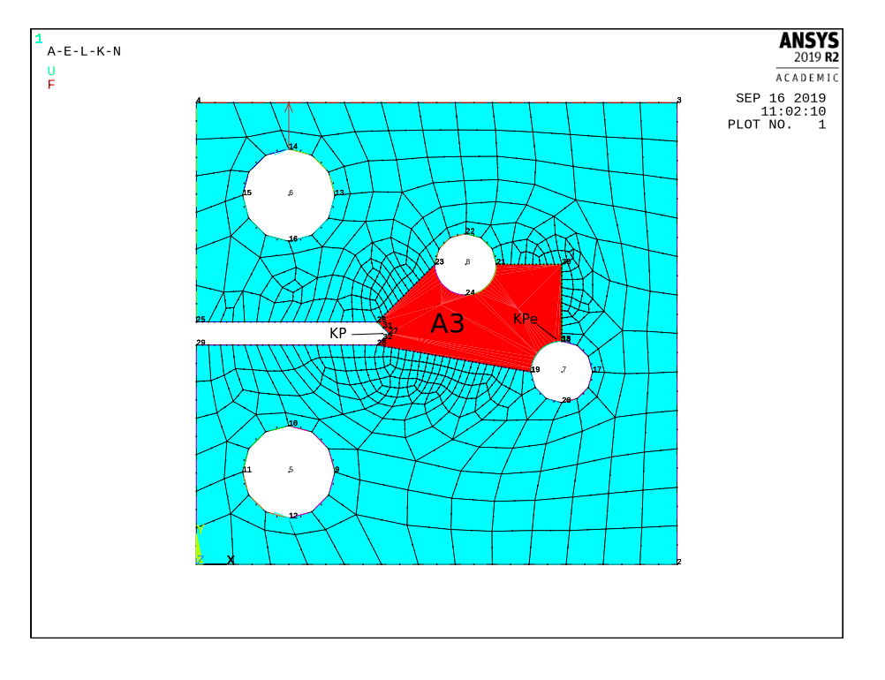
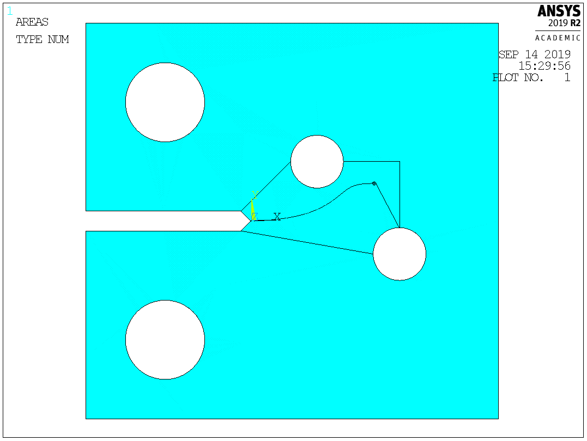
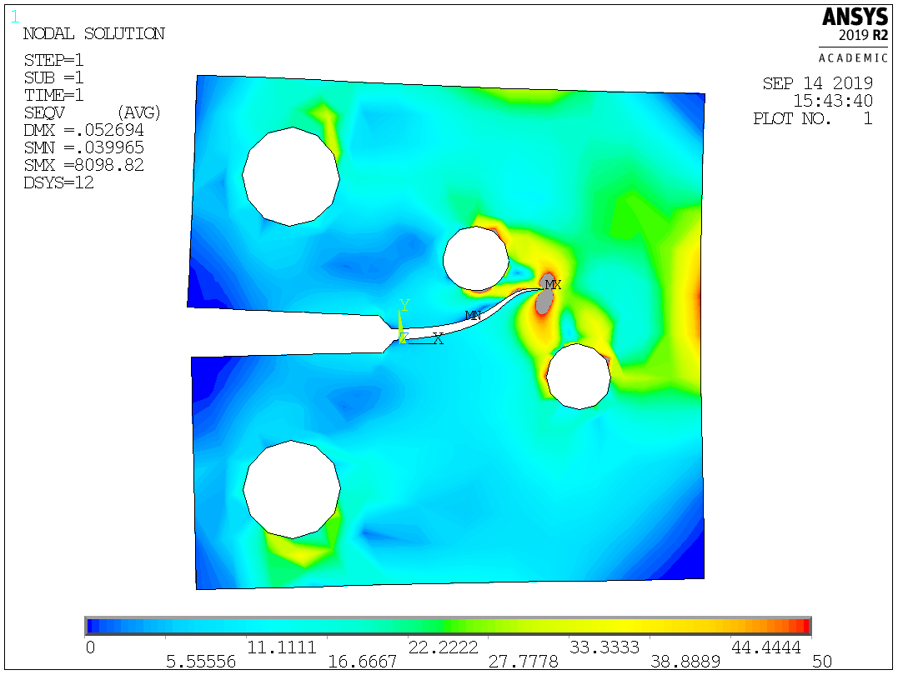

## Background
### Theory
High-cycle fatigue can be generally divided into three stages: crack **nucleation**, crack **growth**, and eventually brittle **failure**. Here, I focus on the second stage - stable crack growth. Under certain conditions, the crack growth can be described by the Paris-Erdogan law (logarithmically linear dependence between the number of cycles and the stress intensity factor K). Predictions of the lifetime (number of cycles) of a sample with a pre-existing crack or predictions of the crack path are of crucial importance in assessing the conditions of engineering structures subjected to cyclic loading, such as shafts, switches and others. Furthermore, the ability to predict the crack path using computer simulations allows one to optimize the structural properties with an effort to prevent the failure.

### Aims
The aim is to write an APDL script which can be used to model the crack growth in an arbitrary 2D geometry in ANSYS Mecanical APDL using the plane elements. The employed theory is based on the assumptions of the linear elastic fracture mechanics (LEFM).

### Algorithm
In this approach, the crack surfaces are modelled explicitly at each time step (crack increment) and the geometry (crack propagation zone) is (re-)meshed at each time step too. Although the remeshing approach may not (in terms of computational time) be very efficient when modelling a crack growth, it does the job.

The crack angle at each iteration is predicted from the stress intensity factors  and  calculated from the displacement field near the crack tip <a href="https://doi.org/10.1115/1.3656897">[Erdogan et al., 1963]</a>, (employing the special element property that models the crack singularity by shifting the element nodes to one-quarter of the element length):

where the stress-intensity factors are calculated from the crack tip nodal displacements (see ANSYS's documentation)

where  for plane stress and  for plane strain.

## Demonstration
Here, I demonstrate how to prepare the geometry and run the code to predict the crack path. This demo was tested with Mechanical APDL 2019 R2 (Academic version - limited to 32000 nodes).

### Geometry

First, create the desired geometry model in 2D. As an example I choose the following 2D modified CT sample illustrated in the YouTube video.

Notice that the geometry has to contain an area (in this case A3 shown in the figure below) in which the crack is expected to propagate. This area will be (re)-meshed automatically. The keypoint of the crack initiation (KP = 27) and the expected final crack position (KPe = 33) have to be defined on the boundary (NOT within). The size of the crack propagation zone (A3) and the choice of the keypoint of the expected final crack position do not influence the result; however, they influence the efficiency (time to remesh) and stability of the solution.

dimensions                   | finite element mesh
:---------------------------:|:---------------------------:
  | 

The code to generate this geometry is provided in the file `CT_modified.mac`.

### Running the macro

- Download and copy the macro MTSC.mac into your home directory (usually This PC > OS(C:) > Users > your_username)
- Type MTSC in the ANSYS's command line to call the macro.
- A window will appear to provide basic input parameters. For now, you can keep the default values.

This code has been most recently tested with ANSYS Mechanical APDL 2019 R2 (Student Version - limited mesh size) and some older versions.

> **I had to modify the original code to make it compatible with this new version of ANSYS. I noticed that 'SET, LAST' is necessary to include to read the last set of results before one can plot the solution nodal data.**

### Analysing the results

The final geometry is shown in the figure below:

final geometry               | von-mises stress
:---------------------------:|:---------------------------:
  | 

## FAQ
Feel free to use, share and modify the code to your needs. While there is a lot to improve, I hope the algorithm will provide some inspiration on how to approach solving such problems. If you use the code, please cite the following thesis:

<a href="https://www.vutbr.cz/en/students/final-thesis?zp_id=49360">Mikula Jakub, Numerické modelování šišení trhlin v rámci platnosti LELM. Brno: Vysoké učení technické v Brně, Fakulta strojního inženýrství, 2012. 60s.</a>

Note that this code was written quite some time ago (y. 2012), and therefore there remains a lot to be improved. Also note that the Academic version may crash when the number of the generated nodes at any iteration reaches more than 32000!

